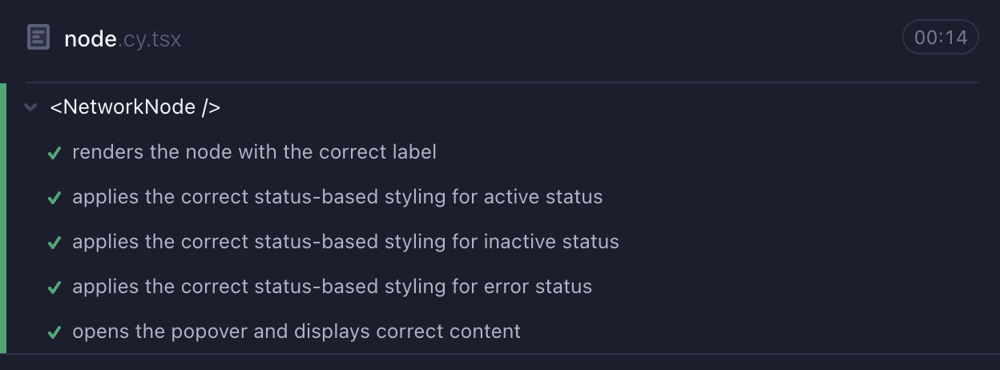

# Scalable Network Graph Application


## Table of Contents

1. [Overview](#1-overview)
2. [Features](#2-features)
   - [Large Dataset Handling](#21-large-dataset-handling)
   - [Responsive Design](#22-responsive-design)
   - [Enhanced Navigation](#23-enhanced-navigation)
   - [Node and Edge Customization](#24-node-and-edge-customization)
   - [Accessibility](#25-accessibility)
   - [Testing and Reliability](#26-testing-and-reliability)
3. [Technologies Used](#3-technologies-used)
4. [React Flow: Core Library Choice](#4-react-flow-core-library-choice)
5. [Installation and Setup](#5-installation-and-setup)
   - [Prerequisites](#prerequisites)
   - [Steps to Run Locally](#steps-to-run-locally)
6. [Deployment](#6-deployment)
7. [Testing](#7-testing)
8. [Accessibility Compliance](#8-accessibility-compliance)
9. [Challenges Addressed](#9-challenges-addressed)

---

## 1. Overview

This project is a **scalable and interactive network graph application** designed to address the challenges of visualizing large datasets in an intuitive manner. It emphasizes usability, performance, and responsiveness.

---

## 2. Features

### 2.1 Large Dataset Handling

- Efficiently renders graphs with **1000+ nodes and edges** using `useMemo` and `useCallback` for optimized updates.

### 2.2 Responsive Design

- Adapts to various screen sizes (desktop, tablet, and mobile).
  

### 2.3 Enhanced Navigation

- **Minimap**: Displays an overview of the graph.
- **Zoom/Reset**: Enables zooming and resetting to the default view.
- **Search Functionality**: Find and center on nodes via search.
  

### 2.4 Node and Edge Customization

- **Node Categorization**:
  - Grayed-Out Nodes: Inactive.
  - Red Nodes: Error states.
  - Violet Nodes: Active nodes.
- **Node Isolation**: Focus on specific nodes, node details and their edges for better visualization of flow.
  
- **Edge Labels and Animations**: Improves clarity and visual flow.
  

### 2.5 Accessibility

- ARIA roles and labels for screen readers.
- Full **keyboard navigation** for node exploration.
  Use `Space` or `Enter` to select nodes and `Tab` to navigate between nodes.

  

- Click on Node to keep it on focus and click again to deselect it(You can also click on the Panel to deselect the node).

### 2.6 Testing and Reliability

- Comprehensive **Cypress tests** for:

  - Network Graph.
    
  - Nodes.
    
  - Edges.
    

## 3. Technologies Used

- **React**: Efficient UI rendering.
- **React Flow**: Core graph visualization library.
- **TypeScript**: Ensures type safety.
- **TailwindCSS**: Streamlines styling.
- **json-server**: Mock API for local development.
- **ShadCn and RadixUI** for quick component usage

## 4. React Flow: Core Library Choice

### Why React Flow?

1. **Performance**: Handles large graphs with viewport-based rendering.
2. **Ease of Use**: Prebuilt components like `<MiniMap />`, `<Controls />`, and `<Background />`.
3. **Customization**: Flexible node/edge types with custom data.
4. **Accessibility**: ARIA support and keyboard navigation.
5. **Developer Productivity**: TypeScript compatibility, robust hooks, and built-in animations.

## 5. Installation and Setup

### Prerequisites

- Node.js (v16+)
- npm or yarn
- Python (for dataset modification)

### Steps to Run Locally

1. **Clone the Repository**

   ```bash
   git clone https://github.com/Shahriar-Rumel/scalable-graph
   cd scalable-graph
   ```

2. **Add Environment Variables**

   create a .env folder in the root directory and add this variable

   ```bash
      VITE_BASE_URL=http://localhost:3001/network
   ```

3. **Install Dependencies**

   ```bash
   npm install
   ```

4. **Start the Development Server**

   ```bash
   npm run dev
   ```

   It will run the vite dev server as well as json-server to mock the graph data from api folder.

5. **Access the Application**

   Open `http://localhost:5173` in your browser.

6. **Modify the Dataset**

   If you want to modify the dataset, locate the file `generate_graph.py` and update the node number and other parameters

   

   then run:

   ```bash
   python generate-graph.py
   ```

---

## 6. Deployment

A live version is available on **[Vercel](https://netmaker-episode.vercel.app/)**.

## 7. Testing

Run tests with:

```bash
npm run test
```

## 8. Accessibility Compliance

- Follows basic ARIA guidelines.
- Keyboard-friendly navigation.

## 9. Challenges Addressed

- **Performance**: Smooth interaction with large datasets.
- **Clutter-Free UI**: Features like minimaps, node isolation, and search.
- **User Experience**: Animated edges and responsive design.
